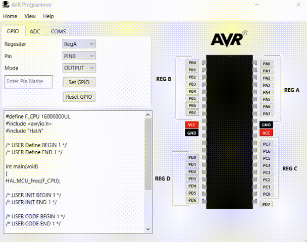

# AvR_Programmer - Unleash Atmega's Power!

**A versatile and user-friendly toolkit for coding Atmega microcontrollers.**

Simplify GPIO configuration, set up ADC for analog input, and enable UART, SPI, and I2C modules effortlessly. 

Future plans include support for timers, servo , and stepper motors.

Ideal for developers, students, and hobbyists.
## Open Source

AvR_Programmer is an open-source project, and we welcome contributions from the community. 
Whether you want to report a bug, suggest a new feature, or submit a pull request, your participation is highly appreciated.
We believe in the power of collaboration and look forward to building an amazing community around AvR_Programmer.

## How to add HAL files and folders to atmel studio project
https://microchip.my.site.com/s/article/Add-multiple-files-and-folders-to-existing-project-in-Atmel-Studio6#:~:text=How%20to%20add%20multiple%20files,as%20shown%20in%20the%20snapshot

## You can find the .exe app here
[drive.google.com/drive/u/3/folders/1OBa--QpIOCpvM8UnHL8UK0IO5kgD0wVl](https://drive.google.com/drive/u/3/folders/1OBa--QpIOCpvM8UnHL8UK0IO5kgD0wVl)

##  Setting GPIOs

**How to set GPIO pin input/output and/or give them name**

##  Dependencies
python 3.11.4 

PySide6
